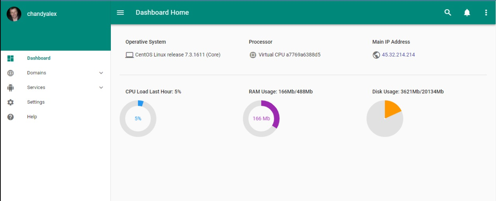
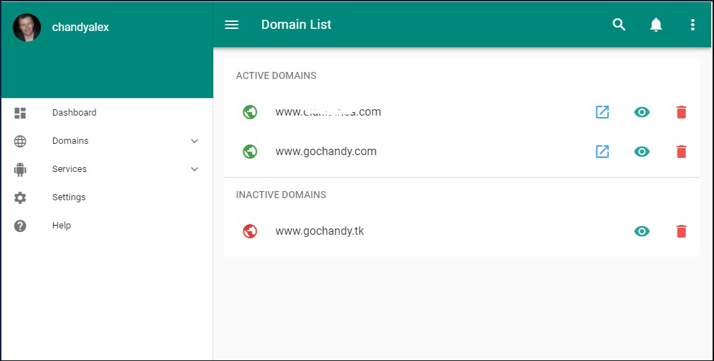

# [](https://www.gochandy.com/) GoChandyCP (frontend)

> This is Vue.js project made for the management of VPS through web interface (SPA) involving a wide of technologies.

###### NOTES
- The project stills in development and this is only the base for now, almost all the features are pending to develop.
- The API code are not available in this repo (still private)

###### PREVIEW
- Dashboard
# 
- Domain List
# 

## Technologies
- Based on the Webpack template of [VueJS-Cli](https://github.com/vuejs/vue-cli)
- [Vue-Router](https://router.vuejs.org/es/essentials/getting-started.html) for handling app routes
- [Vuex](https://vuex.vuejs.org/en/intro.html) for management of the app states
- [Axios](https://github.com/mzabriskie/axios) for make request to a server (API Requests)
- [Vuetify](https://vuetifyjs.com/) for beautiful material design components

## Features
- Get VPS server information
- Manage Nginx domains
- Manage database engines
- Manage services
- Manage Firewall
- Manage OpenVPN
... and more

## Build Setup

``` bash
# install dependencies
npm install

# serve with hot reload at localhost:8080
npm run dev

# build for production with minification
npm run build

# build for production and view the bundle analyzer report
npm run build --report
```

## Others
The implementation of Axios has been made `globally`, so any component can access the `$axios` for make its own request in this way:
```js
export default {
  data () { },
  created () { },
  methods: {
    methodName () {
      this.$axios.get('http://some-resource.url/here')
      .then(response => { })
      .catch(e => { })
    }
  }
}
```
Router components are loaded in `LazyLoad` way as described [here](https://router.vuejs.org/es/advanced/lazy-loading.html), so router loads the component when it is needed and not at first page load:
```js
// Lazy Loading
const Dashboard = resolve => require(['@/components/Dashboard'], resolve)
const DomainList = resolve => require(['@/components/DomainList'], resolve)
```
## Usefull Links
- https://laracasts.com/series/learn-vue-2-step-by-step
- https://router.vuejs.org/es/advanced/lazy-loading.html
- https://vuejsdevelopers.com/2017/04/22/vue-js-libraries-plugins/

For detailed explanation on how things work, checkout the [guide](http://vuejs-templates.github.io/webpack/) and [docs for vue-loader](http://vuejs.github.io/vue-loader).